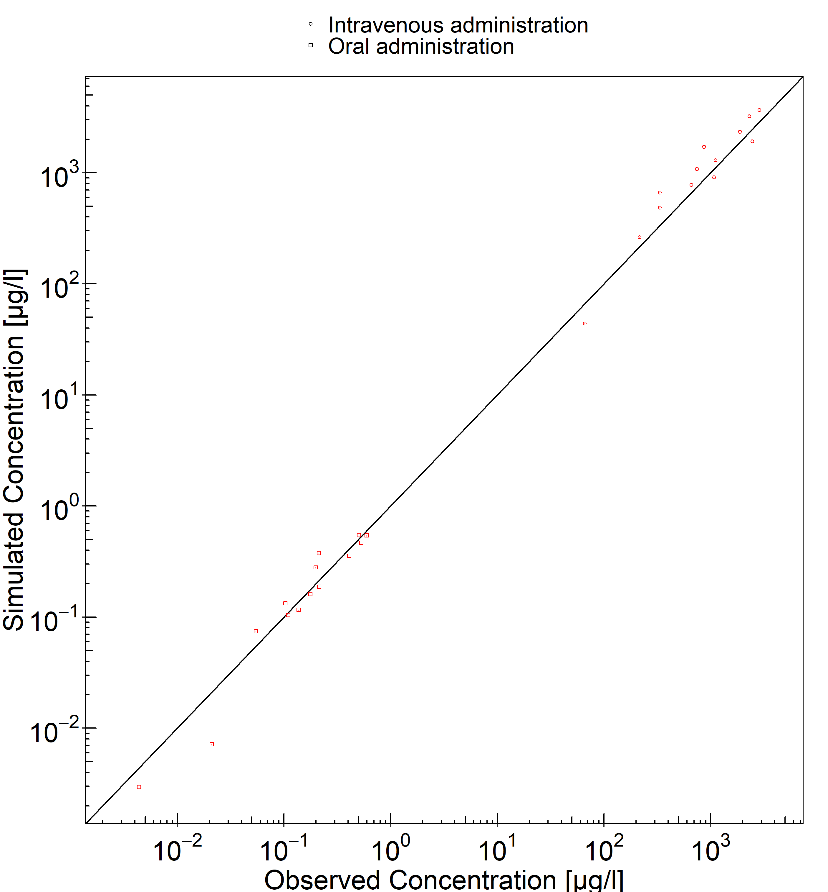
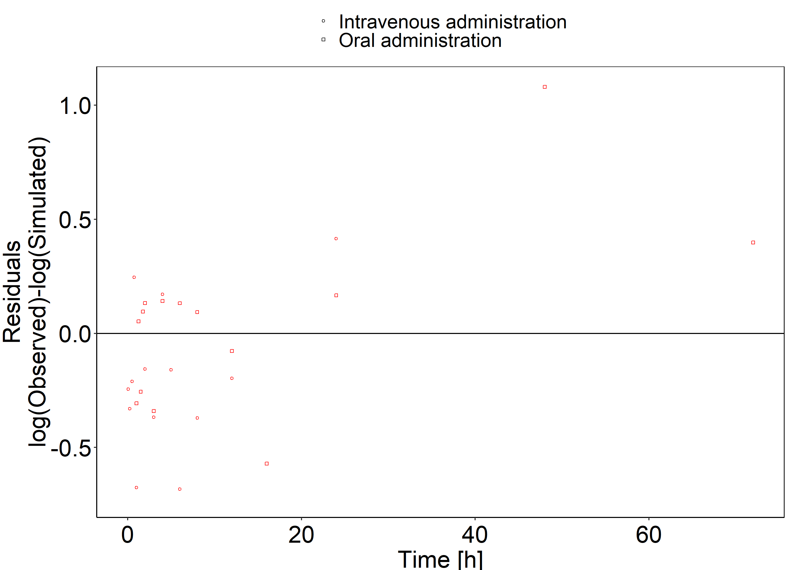
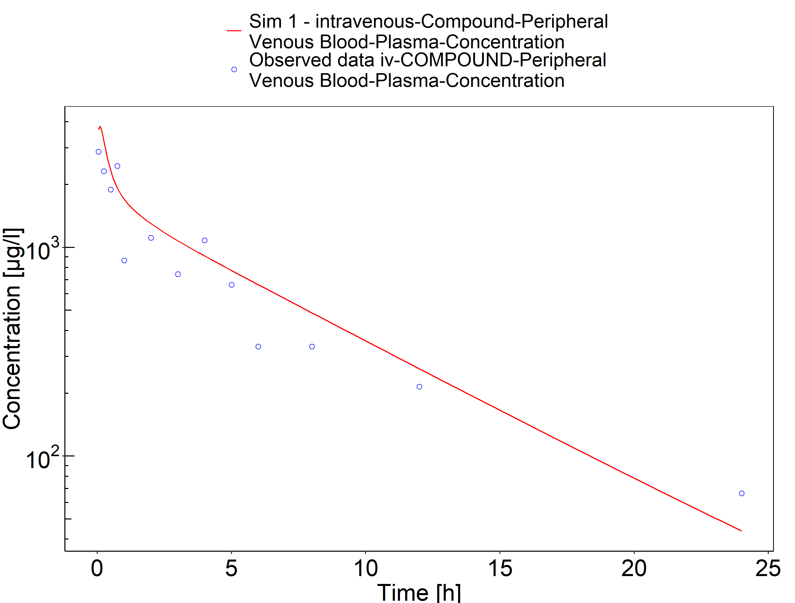
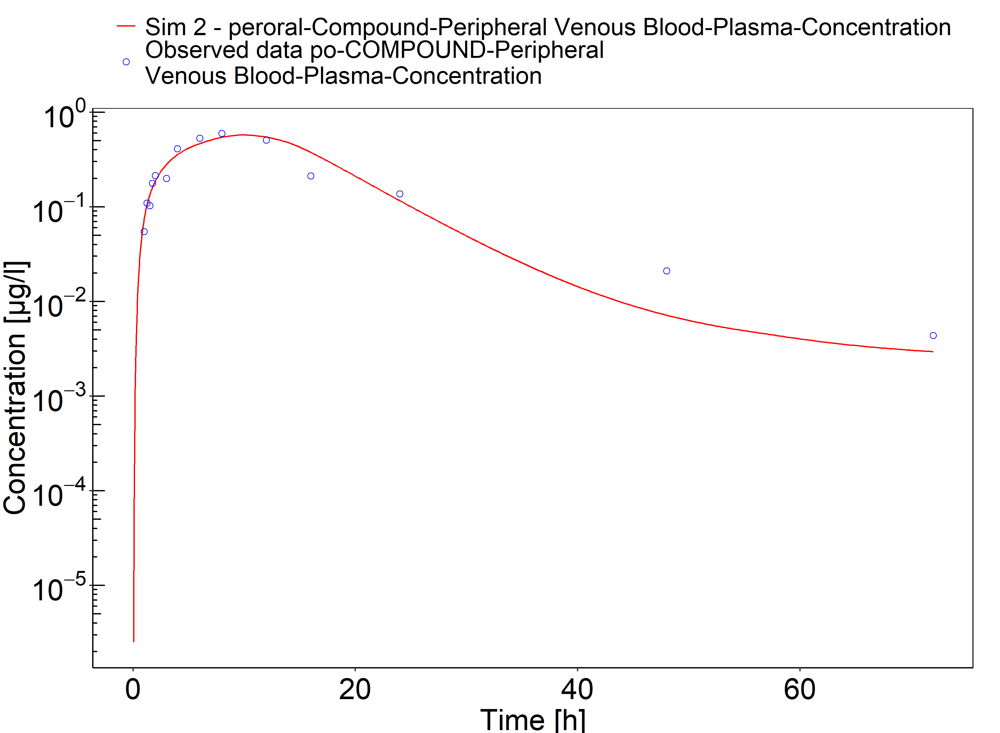

# Building and evaluation of a PBPK model for COMPOUND in healthy adults

| Version                                         | x.x-OSPy.y                                                   |
| ----------------------------------------------- | ------------------------------------------------------------ |
| based on *Model Snapshot* and *Evaluation Plan* | https://github.com/Open-Systems-Pharmacology/COMPOUND-Model/releases/tag/vx.x |
| OSP Version                                     | y.y                                                          |
| Qualification Framework Version                 | z.z                                                          |

This evaluation report and the corresponding PK-Sim project file are filed at:

https://github.com/Open-Systems-Pharmacology/OSP-PBPK-Model-Library/

# Table of Contents

 * [1 Introduction](#introduction)
 * [2 Methods](#methods)
   * [2.1 Modeling Strategy](#modeling-strategy)
   * [2.2 Data](#methods-data)
   * [2.3 Model Parameters and Assumptions](#model-parameters-and-assumptions)
 * [3 Results and Discussion](#results-and-discussion)
   * [3.1 Final input parameters](#final-input-parameters)
   * [3.2 Diagnostics Plots](#diagnostics-plots)
   * [3.3 Concentration-Time Profiles](#ct-profiles)
 * [4 Conclusion](#conclusion)
 * [5 References](#main-references)

# 1 Introduction

COMPOUND is an active, highly selective ... (Information about Pharmacology)

COMPOUND is ...  (Information about relevant Pharmacokinetics)

The herein presented model building and evaluation report evaluates the performance of the PBPK model for COMPOUND in (healthy) adults.

The presented COMPOUND PBPK model as well as the respective evaluation plan and evaluation report are provided open-source ([https://github.com/Open-Systems-Pharmacology/COMPOUND-Model](https://github.com/Open-Systems-Pharmacology/COMPOUND-Model)).

# 2 Methods

## 2.1 Modeling Strategy

The general concept of building a PBPK model has previously been described by Kuepfer et al. ([Kuepfer 2016](#main-references)) Regarding the relevant anthropometric (height, weight) and physiological parameters (e.g. blood flows, organ volumes, binding protein concentrations, hematocrit, cardiac output) in adults was gathered from the literature and has been previously published ([PK-Sim Ontogeny Database Version 7.3](#main-references)). The information was incorporated into PK-Sim® and was used as default values for the simulations in adults.

The  applied activity and variability of plasma proteins and active processes that are integrated into PK-Sim® are described in the publicly available PK-Sim® Ontogeny Database Version 7.3 ([Schlender 2016](#main-references)) or otherwise referenced for the specific process.

First, a base mean model was built using clinical Phase I data including selected single dose studies with intravenous and oral applications (capsule) of dapagliflozin to find an appropriate structure to describe the pharmacokinetics in plasma. The mean PBPK model was developed using a typical European individual. The relative tissue specific expressions of enzymes predominantly being involved in the metabolism of COMPOUND...

Unknown parameters (see below) were identified using the Parameter Identification module provided in PK-Sim®. Structural model selection was mainly guided by visual inspection of the resulting description of data and biological plausibility.

Once the appropriate structural model was identified, additional parameters for tablet formulations were identified. 

The model was then verified by simulating:

- ...

Details about input data (physicochemical, *in vitro* and clinical) can be found in  [Section 2.2](#methods-data).

Details about the structural model and its parameters can be found in  [Section 2.3](#model-parameters-and-assumptions).

## 2.2 Data

### In vitro / physico-chemical Data 

A literature search was performed to collect available information on physicochemical properties of dapagliflozin. The obtained information from literature is summarized in the table below. 

| **Parameter**   | **Unit** | **Value** | Source                                     | **Description**                                 |
| :-------------- | -------- | --------- | ------------------------------------------ | ----------------------------------------------- |
| MW              | g/mol    |           | [Dummy YEAR](#main-references)               | Molecular weight                                |
| pKa  |          |           | [DrugBank DB06292](#main-references)         | Acid dissociation constant                      |
| Solubility (pH) |          |           | [Dummy YEAR](#main-references)               | Aqueous Solubility, FaSSIF, ...                 |
| logP            |          |           | [Dummy YEAR](#main-references) (experimental) | Partition coefficient between octanol and water |
| fu              | %        |           | [Dummy YEAR](#main-references)                | Fraction unbound in plasma                      |
| B/P ratio       |          |           | [Dummy YEAR](#main-references)                | Blood to plasma ratio                           |
| ...             |          |           |                                            | ....                                            |

### Clinical Data  

A literature search was performed to collect available clinical data on dapagliflozin in healthy adults.

#### Model Building 

The following studies were used for model building (training data):

| Publication                 | Arm / Treatment / Information used for model building |
| :-------------------------- | :---------------------------------------------------- |
| [Dummy YEAR](#main-references) | Healthy Subjects with a single dose of X mg           |
| ...                         | ...                                                   |
| ...                         | ...                                                   |
| ...                         | ...                                                   |

#### Model Verification 

The following studies were used for model verification:

| Publication                 | Arm / Treatment / Information used for model building |
| :-------------------------- | :---------------------------------------------------- |
| [Dummy YEAR](#main-references) | Healthy Subjects with a single dose of Y mg           |
| ...                         | ...                                                   |
| ...                         | ...                                                   |
| ...                         | ...                                                   |

## 2.3 Model Parameters and Assumptions

### Absorption 

...

### Distribution 

...

After testing the available organ-plasma partition coefficient and cell permeability calculation methods built in PK-Sim, observed clinical data was best described by choosing the partition coefficient calculation by `Rodgers and Rowland` and cellular permeability calculation by `PK-Sim Standard`. 

...

### Metabolism and Elimination 

...

### Automated Parameter Identification 

This is the result of the final parameter identification.

| Model Parameter      | Optimized Value | Unit |
| -------------------- | --------------- | ---- |
| `PK-Sim parameter 1` |                 |      |
| `PK-Sim parameter 2` |                 |      |
| `PK-Sim parameter 3` |                 |      |
| `PK-Sim parameter 4` |                 |      |

# 3 Results and Discussion

The PBPK model for COMPOUND was developed and verified with clinical pharmacokinetic data.

The model was evaluated covering data from studies including in particular

* ...
* ...

The model quantifies ...

The next sections show:

1. the final model parameters for the building blocks: [Section 3.1](#final-input-parameters).
2. the overall goodness of fit: [Section 3.2](#diagnostics-plots).
3. simulated vs. observed concentration-time profiles for the clinical studies used for model building and for model verification: [Section 3.3](#ct-profiles).

## 3.1 Final input parameters

The compound parameter values of the final PBPK model are illustrated below.

### Compound: COMPOUND

#### Parameters

Name                                       | Value       | Value Origin | Alternative | Default
------------------------------------------ | ----------- | ------------:| ----------- | -------
Solubility at reference pH                 | 1 mg/l      |              | Measurement | True   
Reference pH                               | 7           |              | Measurement | True   
Lipophilicity                              | 0 Log Units |              | Measurement | True   
Fraction unbound (plasma, reference value) | 1           |              | Measurement | True   
Is small molecule                          | Yes         |              |             |        
Molecular weight                           | 300 g/mol   |              |             |        
Plasma protein binding partner             | Unknown     |              |             |        

#### Calculation methods

Name                    | Value          
----------------------- | ---------------
Partition coefficients  | PK-Sim Standard
Cellular permeabilities | PK-Sim Standard

#### Processes

##### Systemic Process: Glomerular Filtration-source_data

Species: Human

###### Parameters

Name         | Value | Value Origin
------------ | -----:| ------------:
GFR fraction |     1 |             

### Formulation: Tablet

Type: Weibull

#### Parameters

Name                             | Value   | Value Origin
-------------------------------- | ------- | ------------:
Dissolution time (50% dissolved) | 240 min |             
Lag time                         | 0 min   |             
Dissolution shape                | 0.92    |             
Use as suspension                | Yes     |             

## 3.2 Diagnostics Plots

Below you find the goodness-of-fit visual diagnostic plots for the PBPK model performance of all data used presented in [Section 2.2.2](#clinical-data).

The first plot shows observed versus simulated plasma concentration, the second weighted residuals versus time. 

**Table 3-1: GMFE for Goodness of fit plot for concentration in plasma**

|Group                      |GMFE |
|:--------------------------|:----|
|Intravenous administration |1.38 |
|Oral administration        |1.32 |
|All                        |1.35 |

 
 

**Figure 3-1: Goodness of fit plot for concentration in plasma**

 
 

**Figure 3-2: Goodness of fit plot for concentration in plasma**

 
 

## 3.3 Concentration-Time Profiles

Simulated versus observed concentration-time profiles of all data listed in [Section 2.2.2](#clinical-data) are presented below.

**Figure 3-3: Sim 1 - intravenous**

 
 

**Figure 3-4: Sim 2 - peroral**

 
 

# 4 Conclusion

The herein presented PBPK model adequately describes the pharmacokinetics of COMPOUND in adults.

In particular, it applies quantitative ... Thus, the model is fit for purpose to be applied for...

# 5 References

**Kuepfer 2016** Kuepfer L, Niederalt C, Wendl T, Schlender JF, Willmann S, Lippert J, Block M, Eissing T, Teutonico D. Applied Concepts in PBPK Modeling: How to Build a PBPK/PD Model.CPT Pharmacometrics Syst Pharmacol. 2016 Oct;5(10):516-531. doi: 10.1002/psp4.12134. Epub 2016 Oct 19. 	

**PK-Sim Ontogeny Database Version 7.3** ([https://github.com/Open-Systems-Pharmacology/OSPSuite.Documentation/blob/38cf71b384cfc25cfa0ce4d2f3addfd32757e13b/PK-Sim%20Ontogeny%20Database%20Version%207.3.pdf](https://github.com/Open-Systems-Pharmacology/OSPSuite.Documentation/blob/38cf71b384cfc25cfa0ce4d2f3addfd32757e13b/PK-Sim%20Ontogeny%20Database%20Version%207.3.pdf))	

**Schlender 2016** Schlender JF, Meyer M, Thelen K, Krauss M, Willmann S, Eissing T, Jaehde U. Development of a Whole-Body Physiologically Based Pharmacokinetic Approach to Assess the Pharmacokinetics of Drugs in Elderly Individuals. Clin Pharmacokinet. 2016 Dec;55(12):1573-1589. 	

**Dummy YEAR** Dummy D, Doe J, Doe A. Pharmacokinetic study of COMPOUND. JOURNAL. YEAR Mon;ISSUE:PAGES. doi: DOI.	

